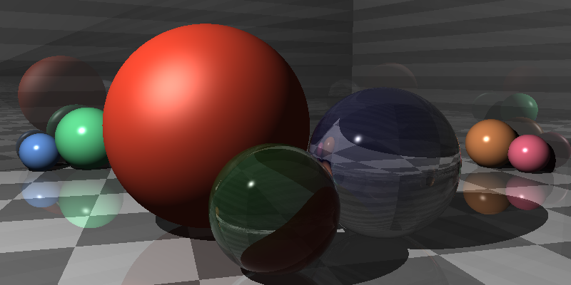
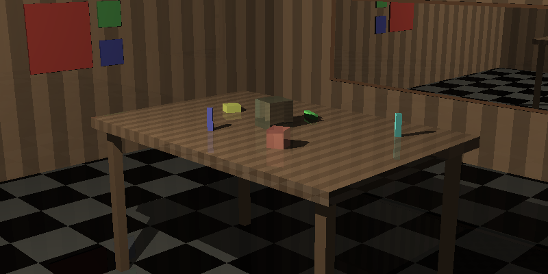
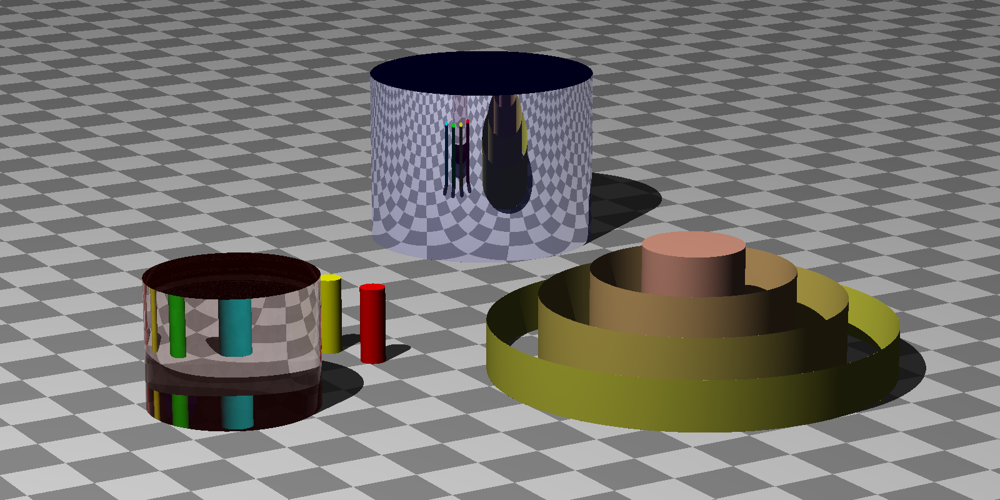

# Ray Tracer

**Current status:** In progress.

A ray tracer implemented in C++17 based on Jamis Buck's book:

https://pragprog.com/book/jbtracer/the-ray-tracer-challenge

**NOTE:** I originally intended to attempt to write a `constexpr` ray tracer to learn more about it; however, due to the size of the project and having done many other projects in `constexpr`, as well as being under a time restriction due to being a technical reviewer for the book, I decided to implement it as a run-time library.

The current code may not compile under clang, and requires GCC in C++17 mode. It also requires cmake 3.12, as it uses list transformers.

My current goals are to:

1. Complete the book and any bonus material;

2. Simplify scene creation by adding convenience methods, and trying to hide the use of smart pointers more; and

3. Implement a parser for a modeling language to simplify modeling.

Here are some images generated by the ray tracer thus far:

Showing reflection and refraction:

A scene made entirely of cubes:

Cylinders:

