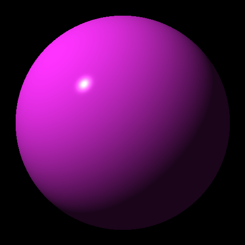

# (Compile-time) Ray Tracer

Initially, I inteded to make a compile-time implementation of a ray tracer using Jamis Buck's book, The Ray Tracer Challenge:

https://pragprog.com/book/jbtracer/the-ray-tracer-challenge

My goal was to attempt to make the entire scene render at compile-time, with the primary motivation to teach myself more about C++ template metaprogramming. Thus far, I have written compile-time vector and matrix operations, as well as a compile-time mixed-type array implementation using `std::variant` to simulate static polymorphism so as to be able to work with arrays of different objects with same-signatured methods, which will be necessary.

Note that the current code will not compile under clang, and requires GCC in C++17 mode.

**NOTE:** Due to time constraints (as a technical reviewer of "The Ray Tracer Chhallenge"), I have decided to implement the ray tracer to work at run-time instead of entirely at compile-time. In the future, I plan to branch off this and modify it to render at compile time.

